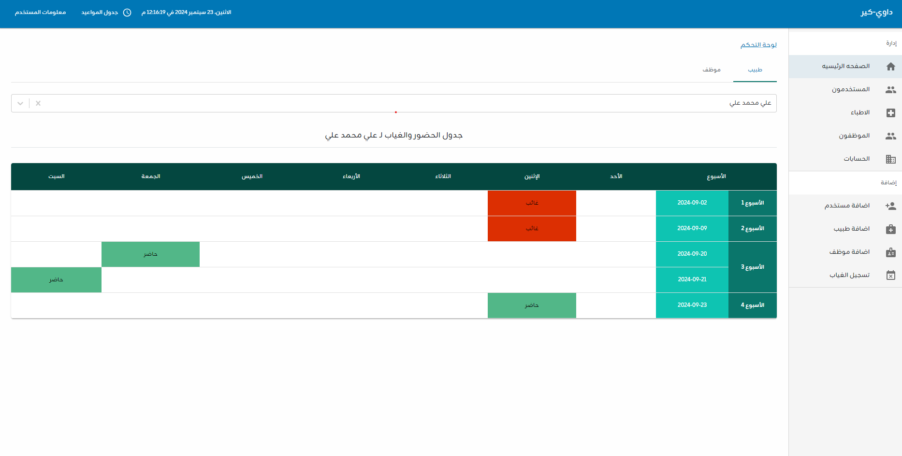
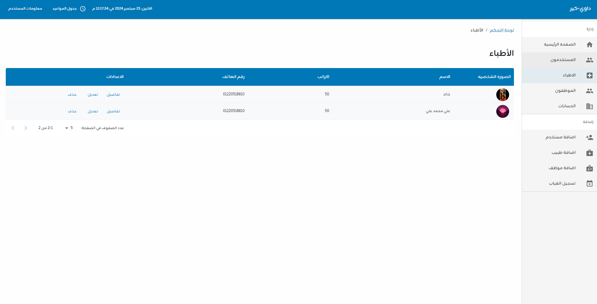
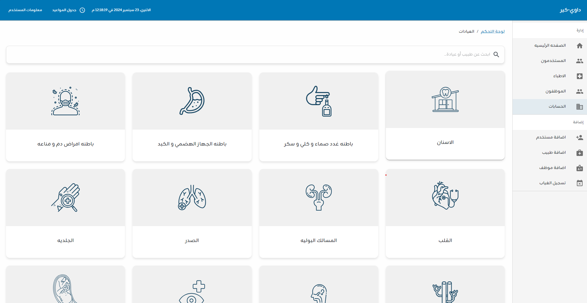
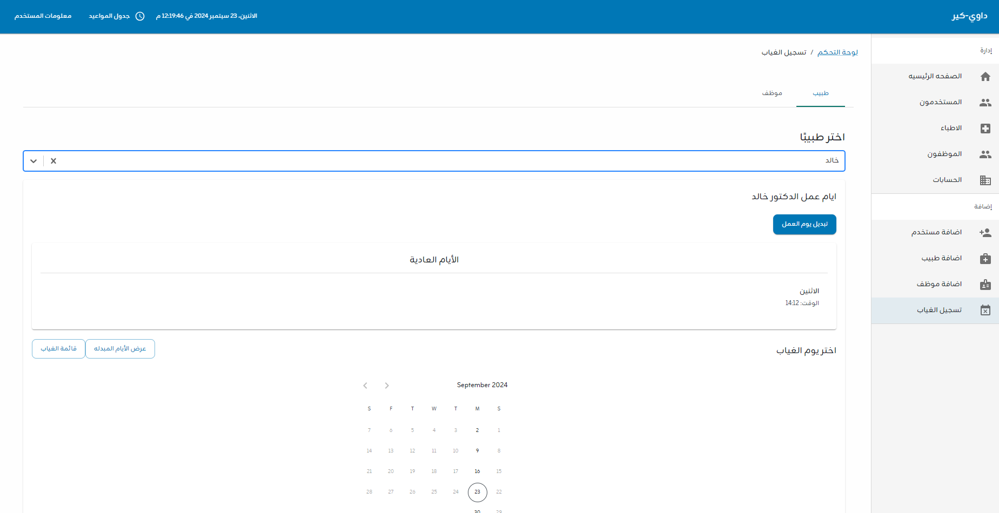

# Dawi-Care

A web application designed for a medical center to manage employees, doctors, salaries, and attendance records efficiently.

## Table of Contents
- [Project Title](#project-title)
- [Features](#features)
- [Technologies](#technologies)
- [Installation](#installation)
- [Usage](#usage)
- [Screenshots](#screenshots)
- [Contributing](#contributing)
- [License](#license)
- [Contact](#contact)

## Features
- Employee Management: Add, update, and manage employee profiles.
- Doctor Profiles: Track doctors' information, schedules, and payroll.
- Salary Management: Calculate and track employee and doctor salaries.
- Attendance Monitoring: Log employee attendance and generate reports.

## Technologies

This project uses the following technologies:

- **Frontend**: 
    - [React.js](https://reactjs.org/) - JavaScript library for building user interfaces.
    - [TypeScript](https://www.typescriptlang.org/) - Superset of JavaScript for static typing.

## Installation

1. **Clone or Download the Project**:
    - Clone the repository via Git:
    ```bash
    git clone https://github.com/yourusername/dawi-care.git
    ```
    - Or download the project as a ZIP and extract it.

2. **Navigate to the Project Directory**:
    ```bash
    cd dawi-care
    ```

3. **Install Dependencies**:
    Run the following command in the terminal to install the required dependencies:
    ```bash
    npm install
    ```

4. **Start the Frontend**:
    After installation, start the frontend with:
    ```bash
    npm start
    ```

## Usage

After starting the frontend, open your browser and go to:

http://localhost:3000


- **Login**: Enter medical center credentials to access the dashboard.
- **Employee Management**: Add, update, and manage employee data such as name, salary, and attendance.
- **Doctor Management**: View and manage doctor profiles, including working hours and payroll information.
- **Salary Management**: Calculate and view the payroll for all employees and doctors.
- **Attendance Tracking**: Monitor and log attendance for all staff members.

Example commands for development purposes:

- **Run in development mode**:
    ```bash
    npm start
    ```

- **Build for production**:
    ```bash
    npm run build
    ```

## Screenshots

Here’s a preview of how the application looks:






## Contributing

We welcome contributions! To contribute:

1. **Fork the Project**: Click on the "Fork" button at the top of this repository.
2. **Clone the Forked Repo**: Clone the forked project to your machine.
    ```bash
    git clone https://github.com/yourusername/dawi-care.git
    ```
3. **Create a Branch**: Create a new branch for your feature or bugfix.
    ```bash
    git checkout -b feature-name
    ```
4. **Commit Your Changes**: Make your changes and commit them with a descriptive message.
    ```bash
    git commit -m 'Added new feature'
    ```
5. **Push to the Branch**: Push your changes to the feature branch.
    ```bash
    git push origin feature-name
    ```
6. **Open a Pull Request**: Go to the original repository and open a Pull Request (PR) to merge your changes.

## License

This project is licensed under the MIT License - see the [LICENSE](LICENSE) file for details.

## Contact

If you have any questions or issues, feel free to contact me at:  
**Email**: alizeyad407@gmail.com